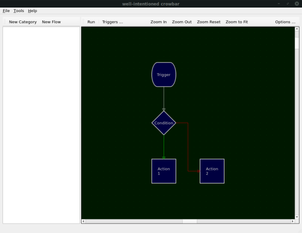

# well-intentioned crowbar
The **well-intentioned crowbar** is a desktop task automation tool with an intuitive visual boxes-and-arrows workflow interface.

This document explains a few things that might be important for users of the crowbar.

## Intent

It is well-known that many users don't outright _desire_ to "get dirty" on a scary command line, they "just want things to work" ... but perhaps a little differently than they do by default.

The well-intentioned crowbar aims to provide a general-purpose automation tool for open source desktop environments. With the crowbar, you can build a graphical flow chart to describe a task, and such tasks will then automatically run when the corresponding trigger events occur.

For instance:
 - you might want your laptop to remember and automatically restore your preferred screen configurations as you move between your home, your desk at the office, and various meeting rooms. There already exists an excellent tool for that particular example, but it does involve venturing into the realm of the command line.
 - you might want the setting for what is your default printer to change appropriately as you move between your home and your office. This, too, is doable with "just a bit of scripting".
 - you might want to change your preferred audio devices when they are (un)plugged. Again, doable, but it doesn't "just happen" out of the box.

These are some of the things you will be able to do from the familiar comfort of a normal desktop application.

<!--- TODO
## Installation
--->

## Usage

During installation, the crowbar will set itself up to start when you log in, but will remain unobtrusive. You only need to open it when you want to create or modify what tasks it's supposed to automate for you. You will find the crowbar in your application menu, or you can click on its icon in the system tray.

### Concepts

The foundation of automating things with the crowbar is the **Task**. A task is a collection of **Components**, bound together using **Wires**. The components determine what to do, and the wires determine the order and flow of execution.

Components may have any number of input and output wires connected to them. Any time a process arrives through an input wire, the component will execute. A component with no output wires will cause its process to terminate; whereas the presence of multiple output wires will serve to fork the flow into several processes, executing subsequent components in parallel. Such continues the flow of execution until no more processes are running for the task.

Components come in three main types:

- **Triggers** wait for certain events to happen. When they do, the trigger will create a flow process for each output wire connected to it, and is thus the initial step in any task. The task continues running until all its processes have terminated.
- **Operations** can be selected from a range of pre-defined actions, or it can be a user script. It will execute when signalled by an input wire, carrying out whatever operation it is meant to do, and may then pass execution on to other components through output wires (or, if it has no output wires, the process is terminated).
- **Conditions** contain scripting which results in a decision that is either `true` or `false`. Depending on the outcome, the process will continue along one or another wire (or set of wires).

Wires come in a few flavours called Modes:

- **Normal** wires simply carry the process from the end of one component to the beginning of another;
- **True/False** wires originate from conditions in accordance with the outcome of the condition;
- **Error** wires continue the process in the event that a condition generated an internal error. If a component fails but has no Error wire, the error is logged and the process is simply terminated.

## Changes

The [roadmap](ROADMAP.md) describes what is being considered for the future. Also, the [change log](CHANGELOG.md#unreleased) might show things that are further along, albeit still unreleased.

<!---
#TODO
## Contributing
--->

## License

This software is distributed under the terms of the GNU General Public License v2 ([TL;DR](https://tldrlegal.com/license/gnu-general-public-license-v2)).

## Thanks

### Heritage

 Not so long ago there was a very neat [automation tool](http://automagic4android.com/) [for Android](https://play.google.com/store/apps/details?id=ch.gridvision.ppam.androidautomagic) that allowed you to do all sorts of things in a very intuitive graphical manner using flowchart block and arrows. Sadly, that project is [no longer maintained](http://automagic4android.com/forum/viewtopic.php?f=5&t=8787), but it gave me the inspiration to replicate the experience for the desktop.

 I would not have even looked for Automagic if it weren't for [Llama](http://kebabapps.blogspot.com/), the "location aware mobile application", which let me automate so many things way back on Android 1.5. It too, sadly, was felled by the rapidly changing nature of Android.

### Motivation

I'm using somewhat of a [hack](https://github.com/noughtnaut/noughty-autorandr) to automatically change my default printer according to the current network connection. It works, but for the wrong reasons. I'd like to make a decent solution for this _and similar_ needs, and I've been meaning to get into open source desktop app development, so I took this as my cue. If I could make something like [Automagic](http://automagic4android.com/), that would be neat.

Further, there once was a desktop app called [Cuttlefish](https://launchpad.net/cuttlefish) which could do sort of what I was after, albeit not as elaborate as Automagic. The fact that it has seen no upkeep since 2012 but the last bug report is from 2017 indicates that people do go out of their way to achieve some level of automation.

### Contributors

If you want to help this project along, I'd be very grateful. I don't, though, have any expectations so I also haven't thought about which might (not?) be desirable. Give it a shot, see what happens! Who knows, perhaps there's special recognition for the first contributor?
